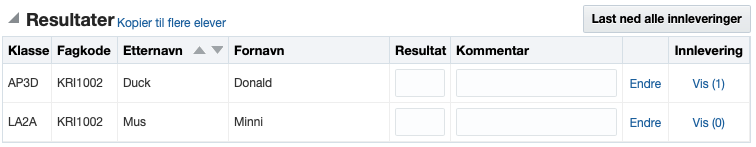

## Innledning
Når en elev leverer et dokument knyttet til en prøve blir dokumentet automatisk kontrollert for likhet. Kontrollen gjøres mot kilder på internett og andre opplastede oppgaver. Selve kontrollen utføres av [Unicheck](https://unicheck.com).

## Hvordan komme i gang. 
Dersom dere ønsker å teste løsningen for plagiatkontroll tar dere kontakt med oss. Vi oppretter da en prøvekonto hos Unicheck og konfigurerer iSkole. Plagiatkonrollen vil da fungere automatisk uten at faglærer trenger å foreta seg noe.

## For faglæreren
Naviger til prøven. _Mine sider > Vurderinger > Fag > Alle elevene i faget > Velg prøven_. 

 
Kolonnen _Innlevering_ viser antall innleveringer. Ved å klikke på _Vis(n)_ kan man se prosent likhet og rapport for den enkelte innlevering. For å laste ned alle innleveringene samt en rapport som viser prosent likehet og en lenke til rapporten for den enkelte innlevering, klikker man på _Last ned alle innleveringer_. Man får da en zipfil som inneholder alle innleveringene og samlerapporten.

## Plagiatrapporten
Se Unicheck sin egen dokumentasjon for detaljer om plagiatrapporten. [Unicheck report - Design and functionality](https://support.unicheck.com/hc/en-us/articles/360015995794-New-Unicheck-Report-Design-and-Functionality).
